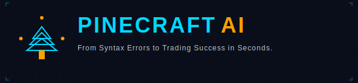

# PineCraft AI Branding Assets

Welcome to the PineCraft AI branding package! This collection includes all the assets needed to implement the futuristic, Tron Legacy-inspired visual identity for your AI-powered Pine Script service.

## 📁 Files Included

### 1. **pinecraft-ai-branding.html**
Interactive brand showcase demonstrating:
- Logo design and variations
- Color palette with hex codes
- Typography examples
- UI component styling
- Brand application examples

### 2. **pinecraft-styles.css**
Complete CSS stylesheet featuring:
- Tron Legacy-inspired animations
- Glow effects and grid patterns
- Responsive design system
- Component styles (buttons, cards, etc.)
- CSS custom properties for easy customization

### 3. **pinecraft-ai-logo.svg**
Scalable vector logo including:
- Geometric pine tree with circuit patterns
- Company name with dual-color treatment
- Full tagline integration (600x140px with proper padding)
- Decorative elements

### 4. **pinecraft-ai-brand-guidelines.md**
Comprehensive brand guidelines covering:
- Brand personality and voice
- Color usage rules
- Typography specifications
- Logo usage guidelines
- Implementation examples

## 🎨 Color Scheme

```css
/* Primary Colors */
--primary-blue: #00D9FF;      /* Electric Blue */
--secondary-orange: #FF9F00;  /* Energy Orange */

/* Supporting Colors */
--deep-space: #0A0E1A;        /* Dark Background */
--grid-blue: #1A4F63;         /* Grid/Secondary Elements */
--electric-white: #F0F8FF;    /* Light Text */
```

## 🚀 Quick Start

1. **View the Brand Showcase**
   ```bash
   open pinecraft-ai-branding.html
   ```

2. **Implement the Styles**
   ```html
   <link rel="stylesheet" href="pinecraft-styles.css">
   ```

3. **Use the Logo**
   ```html
   
   ```

## 💡 Key Design Features

### Tron Legacy Aesthetic
- Neon blue and orange color scheme
- Animated grid backgrounds
- Glow effects on interactive elements
- Circuit board patterns
- Futuristic typography

### Logo Symbolism
- **Pine Tree**: Represents Pine Script
- **Circuit Lines**: AI and technology
- **Data Nodes**: Trading data flow
- **Geometric Style**: Digital transformation

## 🎯 Use Cases

Perfect for:
- Web application interface
- Marketing materials
- Social media profiles
- Documentation
- Trading dashboards
- Educational content

## ⚡ Animation Effects

The CSS includes several signature animations:
- `grid-move`: Animated background grid
- `pulse-blue/orange`: Glowing pulse effects
- `circuit-flow`: Data flow visualization
- `scan-line`: Futuristic scanning effect

## 📱 Responsive Design

All components are mobile-optimized with:
- Flexible layouts
- Scalable typography
- Touch-friendly interactions
- Adaptive grid patterns

## 🔧 Customization

To customize the brand colors, update the CSS variables:

```css
:root {
    --primary-blue: #00D9FF;     /* Change to your preferred blue */
    --secondary-orange: #FF9F00; /* Change to your preferred accent */
}
```

## 📝 Typography

Required Google Fonts:
```html
<link href="https://fonts.googleapis.com/css2?family=Orbitron:wght@400;700;900&family=Exo+2:wght@300;400;600&family=JetBrains+Mono:wght@400;600&display=swap" rel="stylesheet">
```

## 🎨 Design Philosophy

PineCraft AI's visual identity embodies:
- **Precision**: Clean lines and geometric shapes
- **Innovation**: Futuristic aesthetics and animations
- **Accessibility**: High contrast and readable typography
- **Trust**: Professional color palette and consistent design

## 📄 License

These branding assets are created for PineCraft AI. Please refer to your licensing agreement for usage rights.

---

**Need Help?** Review the brand guidelines document for detailed implementation instructions and best practices. 